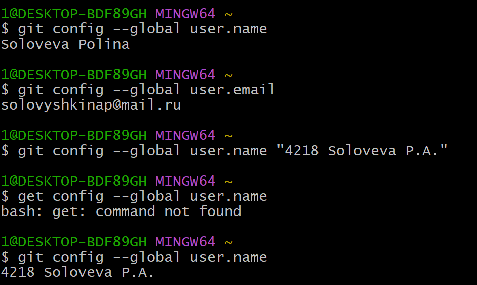
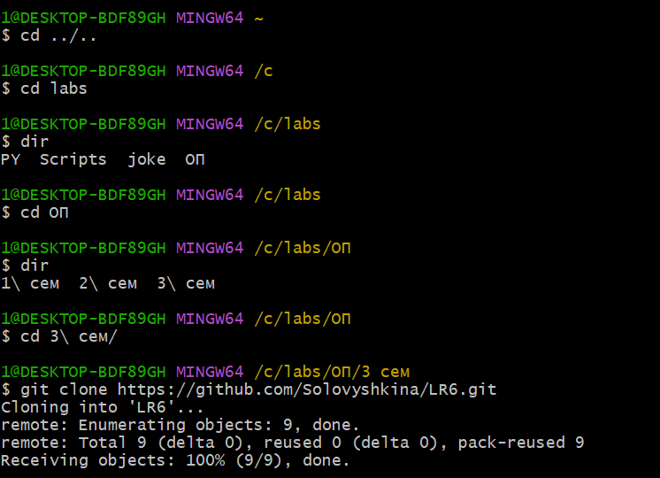
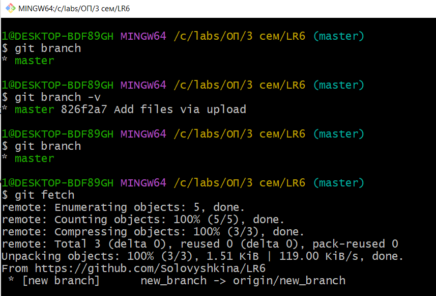
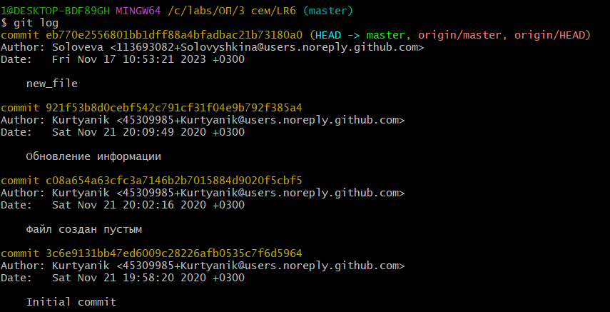
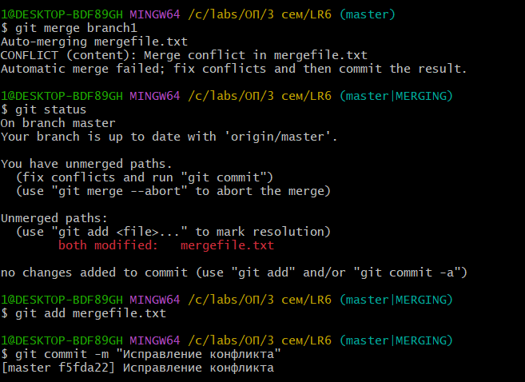
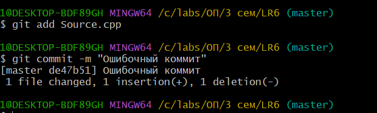
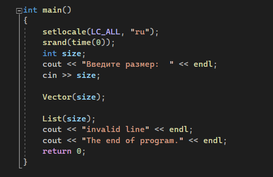
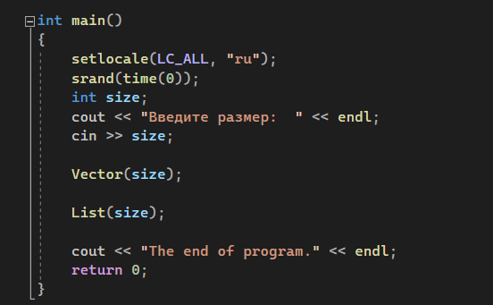
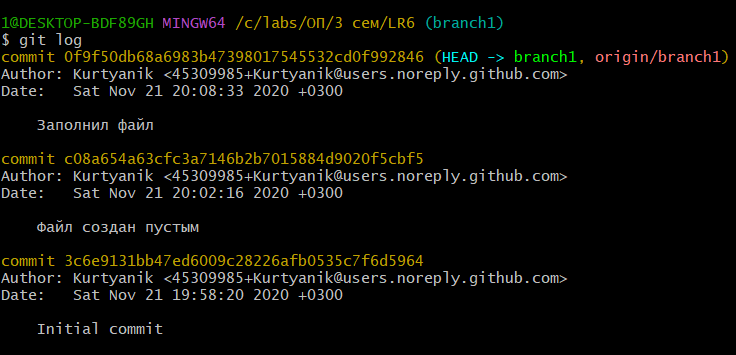
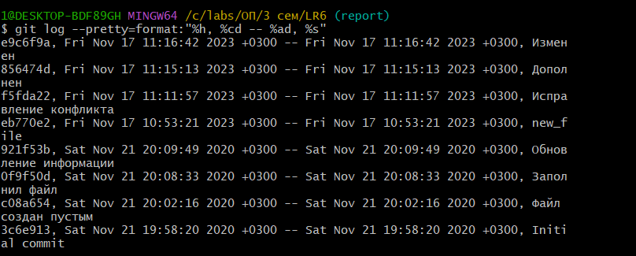

# LR6
## Отчёт о лабораторной работе №6
__Система контроля версий__

Цель лабораторной работы: изучение базовых возможностей системы
управления версиями, опыт работы с Git Api, опыт работы с локальным и
удаленным репозиторием.

*1) Настройка клиента git*

*2) Переход в рабочую директорию и клонирование удаленного репозитория*

*3) Создание новой ветки*

*4) Подтягивание ветки в локальный репозиторий*
)

*5) Получение истории операций для каждой из веток*
)

*6) Выполнение слияния в ветку master и удаление побочной ветки new_branch*
![Выполнение слияния в ветку master и удаление побочной ветки new_branch]

*7) Создание ошибочного коммита*

*8) Откат ошибочного коммита*

*9) Вид фрагмента файла до и после отката коммита*

*10) Корректировка файла*

*11) История всех операций в отформатированном виде*

## Завершение отчёта
